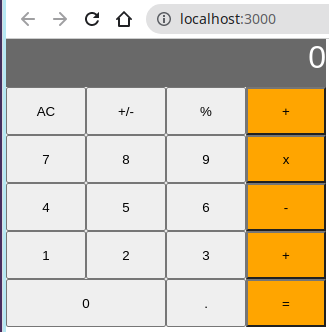

<a name="readme-top"></a>

<div align="center">
  <h3><b>My Math Magician</b></h3>
</div>

<!-- TABLE OF CONTENTS -->

# 📗 Table of Contents

- [📖 About the Project](#about-project)
  - [🛠 Built With](#built-with)
    - [Tech Stack](#tech-stack)
    - [Key Features](#key-features)
  - [🚀 Live Demo](#live-demo)
- [💻 Getting Started](#getting-started)
  - [Setup](#setup)
  - [Prerequisites](#prerequisites)
  - [Install](#install)
  - [Usage](#usage)
  - [Run tests](#run-tests)
  - [Deployment](#triangular_flag_on_post-deployment)
- [👥 Authors](#authors)
- [🔭 Future Features](#future-features)
- [🤝 Contributing](#contributing)
- [⭐️ Show your support](#support)
- [🙏 Acknowledgements](#acknowledgements)
- [❓ FAQ (OPTIONAL)](#faq)
- [📝 License](#license)

<!-- PROJECT DESCRIPTION -->

# 📖 [My Math Magician] <a name="about-project"></a>

**[My Math Magician]** is about a 3 page website using REACT router. The home page has a couple of fixed paragraphs, the calc page has a simple calculator and the quotes page selects a random quote out of a pool quotes.

## Screenshot



## 🛠 Built With <a name="built-with"></a>

### Tech Stack <a name="tech-stack"></a>

Built with React JS, JavaScript, HTML and CSS

<details>
  <summary>Client</summary>
  <ul>
    <li><a href="https://reactjs.org/">React.js</a></li>
  </ul>
</details>

<!-- Features -->

### Key Features <a name="key-features"></a>

> Describe between 1-3 key features of the application.

- **[Welcome/Home page]**
- **[Calculator]**
- **[Quote page]**

<p align="right">(<a href="#readme-top">back to top</a>)</p>

<!-- LIVE DEMO -->

## 🚀 Live Demo <a name="live-demo"></a>

> Add a link to your deployed project.

- [Live Demo Link](https://yourdeployedapplicationlink.com) Not yet available

<p align="right">(<a href="#readme-top">back to top</a>)</p>

<!-- GETTING STARTED -->

## 💻 Getting Started <a name="getting-started"></a>


### Prerequisites

In order to run this project you need to have installed Nodejs

### Setup

Clone this repository to your desired folder:

```sh
  cd my-folder
  git clone https://github.com/gdumani/my-mathmagician.git
```

### Install

Install this project with:

```sh
  cd my-mathmagician
  npm install
```


### Run tests

To run tests, run the following command:

`npm test`

Launches the test runner in the interactive watch mode.\
See the section about [running tests](https://facebook.github.io/create-react-app/docs/running-tests) for more information.

<p align="right">(<a href="#readme-top">back to top</a>)</p>

<!-- AUTHORS -->

## 👥 Authors <a name="authors"></a>

👤 **Giancarlo Dumani**

- GitHub: [@gdumani](https://github.com/gdumani)
- Twitter: [@gdumani1](https://twitter.com/gdumani1)
- LinkedIn: [ Giancarlo-Dumani](https://www.linkedin.com/in/gdumani/?originalSubdomain=cr)


<p align="right">(<a href="#readme-top">back to top</a>)</p>

<!-- FUTURE FEATURES -->

## 🔭 Future Features <a name="future-features"></a>

> Describe 1 - 3 features you will add to the project.

- [ ] **[Deploy the app]**

<p align="right">(<a href="#readme-top">back to top</a>)</p>

<!-- CONTRIBUTING -->

## 🤝 Contributing <a name="contributing"></a>

Contributions, issues, and feature requests are welcome!

Feel free to check the [issues page](https://github.com/gdumani/my-mathmagician/issues).

<p align="right">(<a href="#readme-top">back to top</a>)</p>

<!-- SUPPORT -->

## ⭐️ Show your support <a name="support"></a>

If you like this project please give a star

<p align="right">(<a href="#readme-top">back to top</a>)</p>

<!-- ACKNOWLEDGEMENTS -->

## 🙏 Acknowledgments <a name="acknowledgements"></a>

I would like to thank to Microverse

<p align="right">(<a href="#readme-top">back to top</a>)</p>

<!-- LICENSE -->

## 📝 License <a name="license"></a>

This project is [MIT](./MIT.md) licensed.

_NOTE: we recommend using the [MIT license](https://choosealicense.com/licenses/mit/) - you can set it up quickly by [using templates available on GitHub](https://docs.github.com/en/communities/setting-up-your-project-for-healthy-contributions/adding-a-license-to-a-repository). You can also use [any other license](https://choosealicense.com/licenses/) if you wish._

<p align="right">(<a href="#readme-top">back to top</a>)</p>
